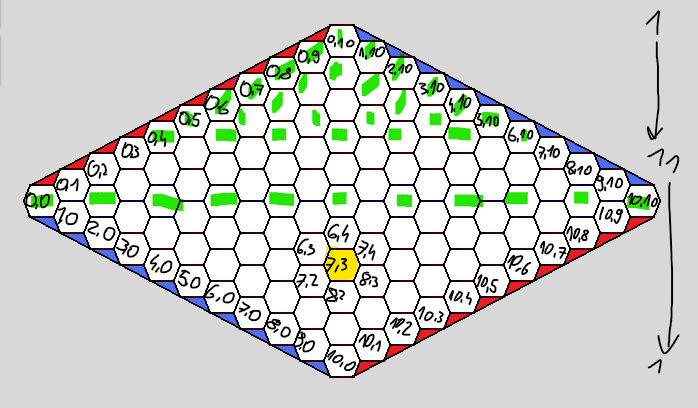

# Projekt Algorytmy i Struktury Danych - gra Hex

## Implementacja
Program implementujący operacje na planszy do gry w Hex po dostaniu na wejściu planszy:
- rozmiar planszy,
- ilość pionów na planszy,
- czy plansza jest poprawna (czy stosunek pionów czerwonych do niebieskich jest osiągalny),
- czy gra się skończyła,
- czy plansza jest możliwa (poprawność + niepominięcie wygranej jednego z graczy),
- czy gracz wygra w 1 lub 2 ruchach przeciwko naiwnemu przeciwnikowi.

Moje zmagania z koordynatami na hexagonalnej planszy :)

